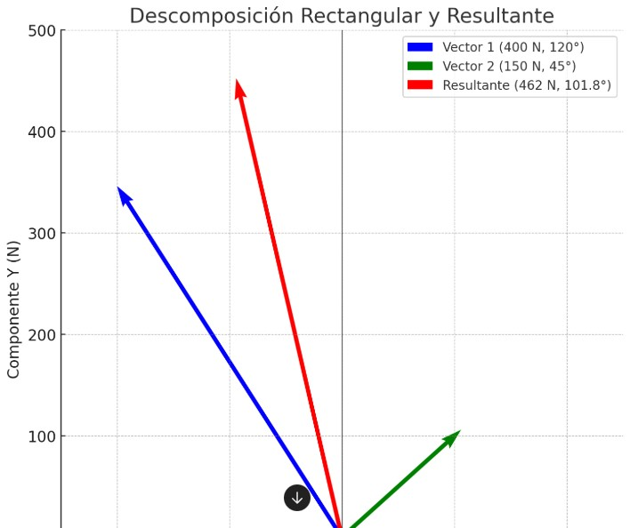

# Ejercicios de Matematica

> 1. Utilizando el método de descomposición rectangular, hallar la resultante y el ángulo que forma
con abscisas, los siguientes vectores que parten del origen del sistema:
- 400 N, 60° hacia la izquierda
- 150 N, 45° hacia la derecha

### Solucion: 

#### Para resolver este problema, vamos a usar el método de descomposición rectangular, descomponiendo cada vector en sus componentes 𝑥(horizontal) e 𝑦(vertical). Luego, sumaremos las componentes y calcularemos la resultante y el ángulo.

- **Datos a resolver:**
1. Magnitud Resultante = ?
2. Angulo Resultante = ?
- **Datos proporcionados**:
1. **Vector 1:**
 - Magnitud = 400N
 - Angulo = 60° hacia la izq del eje x.
2. **Vector 2:**
 - Magnitud = 150N
 - Angulo = 45° hacia la der del eje x.

### Paso 1: Descomponer los vectores en componentes 𝑥 e 𝑦
**Formula para las componentes:**
$$
Componente en x=Magnitud⋅cos(θ)
$$
$$
Componente en y=Magnitud⋅sin(θ)
$$

*Vector 1:*
$$
x_1=400⋅cos(120°)=400⋅(−0.5)=−200N
$$
$$
y_1=400⋅sin(120°)=400⋅(0.866)=346.4N
$$

*Vector 2:*
$$
x_2=150⋅cos(45°)=150⋅(0.707)=106.05N
$$
$$
y_2=150⋅sin(45°)=150⋅(0.707)=106.05N
$$

### Paso 2: Sumar las componentes x e y
$$
x_t = x_1 + x_2 = -200 + 106.05 = -93.95N
$$
$$
y_t = y_1 + y_2 = 346.4 + 106.05 = 452.45N
$$

### Paso 3: Calcular la magnitud resultante
- Usando teorema de Pitágoras:
$$
R = \sqrt{x_t^2 + y_t^2}
$$
$$
R = \sqrt{(-95.95)^2 + (452.45)^2}=\sqrt{8826.6 + 204710.5} = \sqrt{213537.1}
$$
$$
R \approx 462N
$$

### Paso 4: Calcular el angulo con respecto al eje x
$$
\angle = tan^-1(y_t/x_t)
$$

> 2. Dos vectores F1 y F2 actúan sobre un punto, F1 es de 9 N y su dirección forma un ángulo de 70° por encima del eje X en el primer cuadrante, F2 es de 6 N y su dirección forma un ángulo de 43° por debajo del eje X en el cuarto cuadrante. Con la información proporcionada responder:
 - 1. Las componentes de la resultante en X y en Y
 - 2. La magnitud de la resultante
 - 3. La magnitud de la diferencia F1 - F2

*Este es igual a ejercicio 1 solo tiene como agregado calcular la magnitud de la diferencia entre f1 y f2, que se soluciona realizando una resta entre los dos vectores y calculando la magnitud diferencial usando pitágoras.*

> 3. Obtener el trabajo necesario para deslizar un cuerpo 2 km de su posición inicial mediante una fuerza de 1.440 N. 

**Datos a resolver:**
1. Trabajo: W=?
**Datos proporcionados:**
1. Distancia: d = 2km pasamos km a metros = 2000m
2. Fuerza: f = 1440N
3. Tomaremos en cuenta que el angulo $\theta$ de inclinacion donde se aplica la fuerza es 0. 

### Paso 1
- Sabemos que la formula general de trabajo es:
$$
W = F * d * cos\theta
$$
$$
W = 1440N * 2000m * 1
$$
$$
W = 2880000J
$$
> 4.  ¿Qué trabajo realiza una persona para elevar una bolsa 2 m utilizando de 300 N?
- *Igual al ejercicio 3*

>5. Un cuerpo de 210 N cae libremente y tarda 10 s en tocar el suelo.
 - ¿Qué trabajo deberá efectuarse para elevar el cuerpo hasta el lugar desde donde cayó?
 - Determinar la altura desde donde cayó.
 - ¿Con qué velocidad llega a tocar el suelo?

 **Datos a resolver:**
 1. Trabajo: $W = ?$
 2. Altura: $d = ?$
 3. Velocidad final: $V_f = ? $ 

 **Datos proporcionados:**
 1. Fuerza : $F = 210N$
 2. Tiempo total : $t = 10s$

 ### Calcular la altura
 - Ya que el cuerpo cae libremente y teniendo en cuenta la formula de MRUV para calcular la distancia sabiendo que la aceleración de la gravedad es $g = 9.8 m/s^2$:
 $$
 d = 1/2 *g*t^2
 $$
 $$
 d = 1/2 * 9.8m/s^2 *(10s)^2
 $$
 $$
 d = 490m
 $$

 ### Calcular la velocidad final con la que llega al suelo
 - Utilizando la fórmula de la velocidad en un MRUV sabemos que:
 $$
 v = a * t
 $$
 - Donde $a$ es la aceleración de la gravedad
 $$
 v = 9.8m/s^2 * 10s
 $$
 $$
 v = 98m/s
 $$

### Calcular el trabajo para elevar el cuerpo

$$
W = F * d * cos \theta
$$
$$
W = 210N * 490m
$$
$$
W = 1030005 J
$$

> 6. Un proyectil que pesa 78,4 N es lanzado verticalmente hacia arriba con una velocidad inicial de
360 m/s
- ¿Qué energía cinética tendrá al cabo de 5s? 
- ¿Qué altura habrá alcanzado al cabo de 5s? 
- ¿Qué energía potencial tendrá al alcanzar su altura máxima?

**Datos a resolver:**
- Energia Cinetica al cabo de 5s: $E_c = ?$
- Altura a 5s: $d=?$
- Energia potencial en altura maxima: $E_p = ?$

**Datos:**
- Peso del proyectil: $P = 78,4N$
- Vel inicial: $V_i = 360m/s$
- tiempo $t = 5s$
- aceleracion de la gravedad: $g=9,8m/s^2$

*Importante: No confundir masa con peso porque no es lo mismo, peso es una fuerza y masa es la cantidad de gramos de un cuerpo.*

**Como resolver:**
- Sabemos que la formula de la Energia Cinetica es: 
$$
E_c=\frac{1}{2} m v^2
$$

- Donde $m$ es la masa del proyectil
- $v$ es la velocidad en el instante $t= 5s$

**Para obtener la masa usamos la relación $P = m * g$**